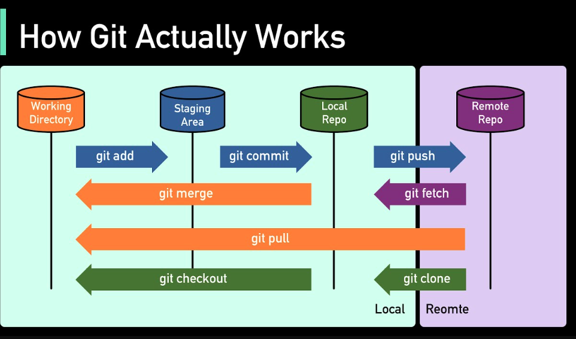

# Git

Este es un repositorio que sirve de introduccion a git

## Comandos mas usados

- `git init` (iniciar git)
- `git status`
- `git add .` (agregar elementos al stagin area)
- `git commit -m "primer commit"`

#### De repositorio local a remoto agregando la url de git hub

- `git remote add origin url de su repositorio`
- `git branch -M main`
- `git push -u origin main`

#### Clonando el repositorio remoto a local

- `git clone` https://github.com/arielZarateDev/GitTutorial.git

### creando Ramas

Las ramas en Git se crean principalmente para permitir el desarrollo paralelo y la gestión de cambios de manera estructurada y controlada. Aquí te explico algunas razones fundamentales por las cuales se utilizan ramas:

Las ramas en Git se crean principalmente para permitir el desarrollo paralelo y la gestión de cambios de manera estructurada y controlada. Aquí te explico algunas razones fundamentales por las cuales se utilizan ramas:

1. Desarrollo paralelo y aislado:
   Funcionalidades nuevas: Cuando se quiere desarrollar una nueva característica o funcionalidad sin afectar el código principal del proyecto, se crea una rama dedicada. Esto permite trabajar de manera independiente y realizar pruebas sin interferir con el código en producción.
   Corrección de errores: Al enfrentar un problema crítico en producción, se puede crear una rama específica para solucionar el error, mientras el desarrollo normal continúa en la rama principal.
2. Facilita la colaboración:
   En equipos de desarrollo, múltiples personas pueden trabajar en diferentes características o problemas simultáneamente sin interferir entre sí. Cada desarrollador puede trabajar en su propia rama y fusionar sus cambios de manera controlada cuando estén listos y probados.
3. Experimentación y pruebas:
   Las ramas son ideales para experimentar con nuevas ideas o cambios radicales. Si el resultado no es satisfactorio, la rama puede eliminarse sin afectar el código principal.
4. Versionado y mantenimiento:
   Las ramas también se utilizan para mantener diferentes versiones de un proyecto. Por ejemplo, tener una rama de producción estable y una rama de desarrollo continuo donde se incorporan nuevas características.
5. Control de calidad y revisión:
   Antes de fusionar cambios en la rama principal (como master), es común utilizar ramas para revisar y validar el código mediante pruebas y revisiones de compañeros.
6. Gestión de riesgos:
   Las ramas permiten gestionar el riesgo al permitir a los equipos realizar cambios significativos de manera aislada y probarlos antes de integrarlos con el código base.

#### Comandos de ramas

- `git branch` (permite ver las ramas)
- `git checkout -b  nombre-de-rama` (nos crea la rama y nos lleva a la misma)
- `git merge nombre-de-rama ` (recordar que debemos estar parado en la rama que deseamos mergear)

### Git Log

El comando git log en Git es una herramienta poderosa para revisar el historial de commits de un repositorio. A continuación, se explica cómo usar git log y sus opciones más comunes para sacar el máximo provecho de esta herramienta.

- `git log`
- `git log --oneline` (Mostrar commits en una línea)
- `git log -p` (mostrar diferencias entre commits)
- `git log  --stat` (Mostrar commits con estadísticas)
- `git log -n 3 ` (muestra 3 commit echos )

### mas comandos

- ` git diff` (Muestra las diferencias entre los cambios no confirmados)

- `git remote add <nombre> <url>` # Añade un nuevo remoto

- `git remote -v` # Lista los remotos existentes

- `git pull  origin ariel ` #Descarga y fusiona cambios desde un repositorio remoto.

- `git fetch origin ariel` #Descarga cambios desde un repositorio remoto sin fusionarlos.

## Documentacion Extra de Digital Ocean

[`https://www.digitalocean.com/community/cheatsheets/how-to-use-git-a-reference-guide`](`https://www.digitalocean.com/community/cheatsheets/how-to-use-git-a-reference-guide`)
